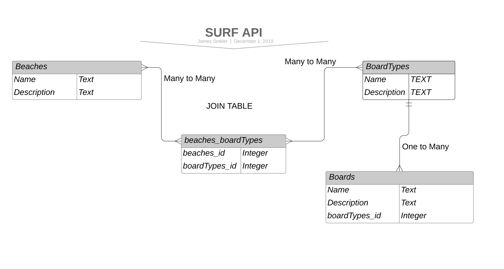

## Surf API



### Tables in the SurfAPI database

Beaches | beaches_boardTypes | boardTypes | boards
------- | ---------------- | ---------- | ---------:
name  | beaches_id | name | name
description  | boardTypes_id | description  | description
(empty)    | (empty)    | (empty)     | boardTypes_id


### Overview of operations avaliable
The Beaches, boardTypes, and boards tables all have full CRUD operation availabe. The beaches_boardTypes JOIN table is only updated when new beaches are created. In order to pass in data as part of the request, the user should use JSON in the request body. The only other way to pass in data with a request is through an id in the route target. Here are some sample routes which would also work with *boardTypes* or *boards* in the place of *beaches*.

### Route targets and example responses
*_To get all beaches_*
```
request: GET
target:	/api/beaches
```
*Sample response:*
```
    {
        "name": "OB",
        "description": "A heavy NorCal beachbreak where the paddle out can be one of the hardest in the world."
    },
    {
        "name": "Cron",
        "description": "Close to shore beachbreak located in Northern California. Dumpy shorepound, good on a South Swell."
    },
	 .....full list of beaches
```

*_To get a specific beach_*
```
request: GET	
target: /api/beaches/3   (where 3 is the beachid)
```
*Sample response:*
```
[
    {
        "name": "Byron Bay",
        "description": "Beach in Australia, baby waves, lots of cruise time."
    }
]
```
*_To delete a beach_*
```
request: DELETE	
target: /api/beaches/3
```
*_To update a beach_* select a target by id and pass in the column wanted to change. In the following, I change the beach name
```
JSON BODY
{
   "name": "Bye Ron Bay"
}
request:PUT
target: /api/beaches/3
```
#### Associate a beach to multiple boardTypes while creating a new beach
Not every surf spot supports all boards. For this reason, when updating a beach it is advised to pass in which boardtypes will work well as the new beach. To create a new beach with an association already, your json body that you pass in as a request will need to have an array of boardtype_ids it is accociated with.

To create a new beach that is accommodating to longboards(1) and fish(3) boardtypes I would send a request as follows

```
JSON BODY
{
	"name": "LongFish beach",
	"description": "Great surfspot. Hardly any localism. Except for the Great Whites.",
	"boardTypeIds": [1, 3]
}
request: POST
target: /api/beaches
```
### Useful Routes
Some useful routes to figure out which board you want to bring to the beach. Or likewise which beach you want to go to to surf a particular board are as follows

*_To get all boards associated with beach.oid = 3(Byron Bay)_*
```
request:GET
target:api/beaches/3/boards

*Sample response:*
    {
        "Beach": "Byron Bay",
        "BoardName": "Big Red",
        "description": "Longboard. 10 ft. It's a log."
    },
    {
        "Beach": "Byron Bay",
        "BoardName": "Stewart Cruiser",
        "description": "Classic longboard cruiser. Catches everything. 9'6"
    },
```
*_To get all beaches good for board.oid = 1 (Stewart Cruiser)_*
```
request:GET
target:api/boards/1/beaches

*Sample response:*
    {
        "BoardName": "Stewart Cruiser",
        "description": "Classic longboard cruiser. Catches everything. 9'6",
        "BoardType": "longboard",
        "Beach": "Byron Bay"
    },
    {
        "BoardName": "Stewart Cruiser",
        "description": "Classic longboard cruiser. Catches everything. 9'6",
        "BoardType": "longboard",
        "Beach": "Bolinas"
    },
```
### Future goals
Ideally the boards used at a specific breach would change given the expected wave size at that beach. Some research is being conducted on using the national weather service api for swell data in order to dynamically change board recomendations.
